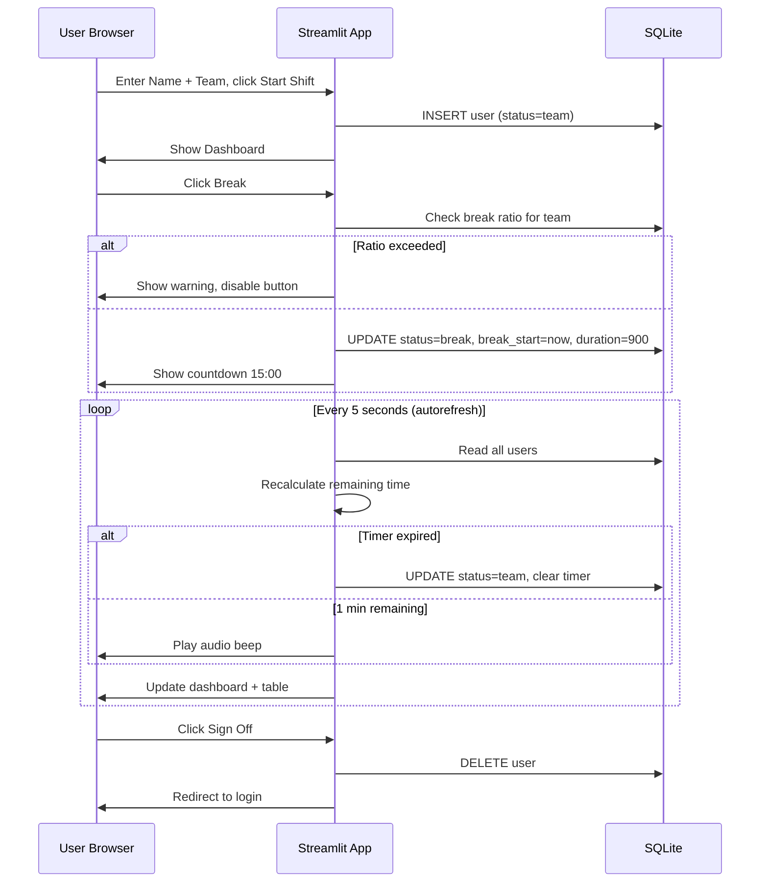

# Streamlit Break Tracker App — Implementation Plan

## Overview
A multi-user Streamlit break tracker for a shift-based workplace with 3 teams. Users log in, manage their status (Team, Break, Lunch, Off), and see real-time counts. Break/Lunch slots are ratio-limited per team. A countdown timer with audio alarm runs for each session.

## Tech Stack
- **Frontend/Backend:** Streamlit (single `app.py`)
- **Shared State:** SQLite (`break_tracker.db`) – persistent, survives restarts
- **Auto-refresh:** `streamlit-autorefresh` (every 5s)
- **Audio Alarm:** CDN-hosted beep via HTML5 `<audio>` in `st.components.v1.html()`
- **Deployment:** Streamlit Community Cloud (`streamlit run app.py`)

## File Structure
```
c:/Users/ahmet/Teamtracker/
├── app.py                  # Main Streamlit application
├── requirements.txt        # Python dependencies
├── .streamlit/
│   └── config.toml         # Streamlit Cloud config
├── plans/
│   └── break-tracker-plan.md   # This plan
└── README.md               # Setup & usage instructions
```

## Database Schema (SQLite)
```sql
CREATE TABLE IF NOT EXISTS users (
    name TEXT PRIMARY KEY,
    team TEXT NOT NULL,
    status TEXT NOT NULL DEFAULT 'team',
    break_start TEXT,         -- ISO 8601 timestamp or NULL
    break_duration INTEGER   -- seconds (900 or 1800) or NULL
);
```

## App Flow

### 1. Login Screen
- Text input: **Name**
- Selectbox: **Team** → `["Phone", "Chat", "Backoffice"]`
- Button: **Start Shift**
- On submit: insert into SQLite with `status = "team"`, `break_start = NULL`, `break_duration = NULL`
- **Edge case:** If name already exists and is active, show warning — "Name already in use. If it's you, refresh the page."

### 2. Main Dashboard (per user)
After login, each user sees:

**Status Buttons (4 buttons in a row) with live counts:**
```
[4]          [2]          [1]
Team Alpha   Break        Lunch       Sign Off
```

- 🔵 **Team** — sets status to `"team"`, clears break_start/duration
- ☕ **Break** — starts 15min timer, but only if team ratio allows
- 🍽️ **Lunch** — starts 30min timer, but only if team ratio allows
- 🔴 **Sign Off** — deletes user from DB, redirects to login

**Break/Lunch Slot Limiting (per team):**
```python
BREAK_RATIO = 0.20   # max 20% on break
LUNCH_RATIO = 0.25   # max 25% on lunch
```
- Count active users on same team (`status != 'off'`)
- Count users on break/lunch for that team
- If `break_count / active_count > BREAK_RATIO`, disable Break button + show warning
- Same for Lunch

**Countdown Timer:**
- Display `⏱️ mm:ss remaining` prominently when on break/lunch
- Auto-refresh every 5s recalculates remaining time
- When countdown reaches 0: auto-reset status to `"team"`
- **1 min before end:** trigger audio alarm via `st.components.v1.html()` with CDN beep

### 3. Personnel Table
Live table of all active users, sorted by team then status:

| Name | Team | Status | Time Remaining |
|------|------|--------|----------------|
| Ali  | Alpha | Break | 08:42 |
| Berk | Alpha | Team | — |
| Ceren| Beta  | Lunch | 21:05 |

- Users with status `"off"` are excluded (they're deleted on Sign Off)
- Table auto-refreshes every 5s

### 4. Session Restoration
On page refresh, check if user's name exists in DB with active status. If yes, restore their session via `st.query_params` or `st.session_state` keyed to name.

## Configuration Block (top of `app.py`)
```python
TEAMS = ["Team Alpha", "Team Beta", "Team Gamma"]
BREAK_DURATION_SEC = 15 * 60   # 15 minutes
LUNCH_DURATION_SEC = 30 * 60   # 30 minutes
BREAK_RATIO = 0.20             # 20%
LUNCH_RATIO = 0.25             # 25%
ALARM_BEFORE_SEC = 60          # Alert 60s before end
REFRESH_INTERVAL_MS = 5000     # 5 seconds
DB_PATH = "break_tracker.db"
```

## Edge Cases to Handle
1. **Page refresh**: Restore session from DB via stored name
2. **Timer expiry while away**: Auto-reset to `"team"` on next auto-refresh cycle
3. **Duplicate name at login**: Warn if name already active in DB
4. **Ratio recalculation**: Break/lunch counts adjust immediately when someone signs off or returns to team
5. **Sign Off**: DELETE from DB, counts recalibrate, user returns to login
6. **Empty table**: Handle gracefully when no users active

## Sequence Diagram



## Implementation Order (Todo List)

1. **Initialize project** — Create `app.py`, `requirements.txt`, `.streamlit/config.toml`, `README.md`
2. **Database layer** — SQLite connection, table creation, CRUD functions (add_user, get_user, update_status, delete_user, get_active_users)
3. **Login screen** — Name input, team select, Start Shift button, duplicate name check
4. **Dashboard layout** — 4 status buttons with live counts, ratio logic, button disable/enable
5. **Timer logic** — Countdown calculation, auto-reset on expiry, audio alarm 1min before end
6. **Personnel table** — Live table sorted by team/status, showing remaining time
7. **Session restoration** — Restore user session on page refresh using query params or session state
8. **Audio alarm** — HTML5 audio component with CDN beep, triggered at 1min mark
9. **Streamlit Cloud config** — `.streamlit/config.toml` with theme and server settings
10. **README** — Setup instructions, how to run locally, how to deploy
