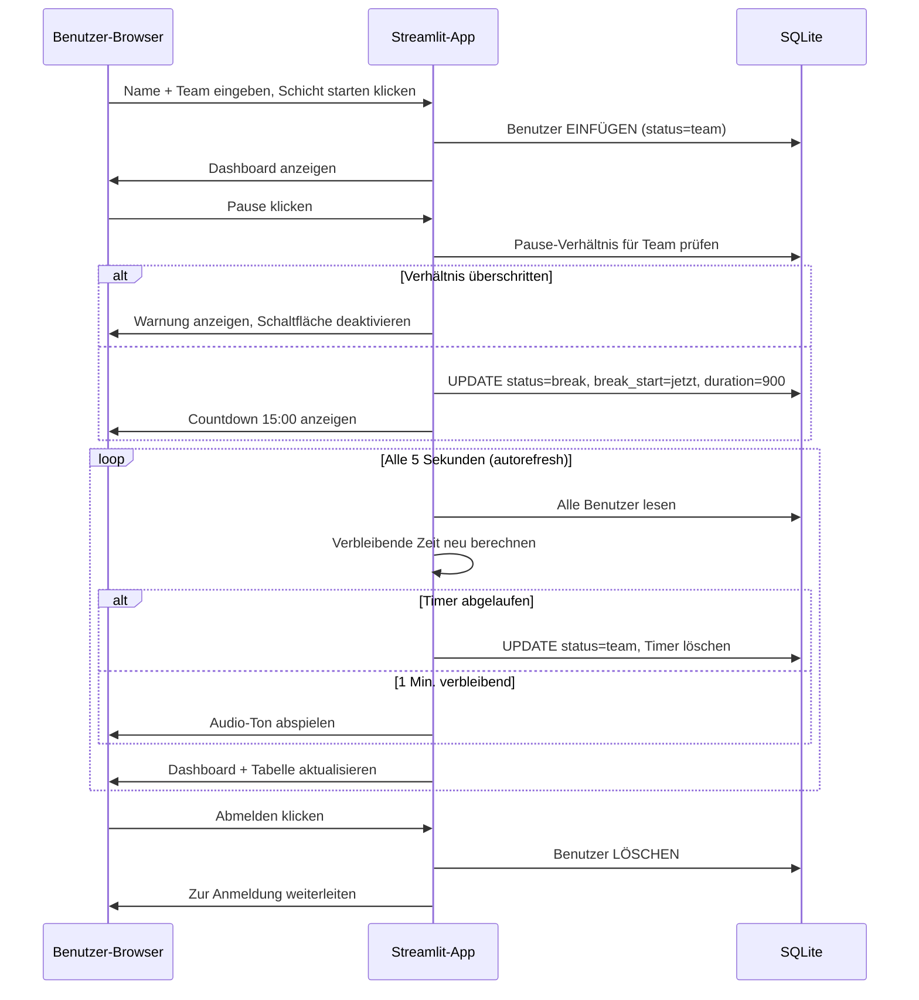

# Streamlit Pausen-Tracker-App — Implementierungsplan

## Übersicht
Ein Mehrbenutzer-Streamlit-Pausen-Tracker für einen schichtbasierten Arbeitsplatz mit 3 Teams. Benutzer melden sich an, verwalten ihren Status (Arbeitsplatz, Pause, Mittagspause, Aus) und sehen Echtzeit-Anzahlen. Pause-/Mittagspause-Plätze sind pro Team verhältnislimitiert. Ein Countdown-Timer mit Audio-Alarm läuft für jede Sitzung.

## Tech-Stack
- **Frontend/Backend:** Streamlit (einzelne `app.py`)
- **Gemeinsamer Zustand:** SQLite (`break_tracker.db`) – persistent, übersteht Neustarts
- **Auto-Aktualisierung:** `streamlit-autorefresh` (alle 5s)
- **Audio-Alarm:** CDN-gehosteter Ton via HTML5 `<audio>` in `st.components.v1.html()`
- **Deployment:** Streamlit Community Cloud (`streamlit run app.py`)

## Dateistruktur
```
c:/Users/ahmet/Teamtracker/
├── app.py                  # Haupt-Streamlit-Anwendung
├── requirements.txt        # Python-Abhängigkeiten
├── .streamlit/
│   └── config.toml         # Streamlit Cloud Konfiguration
├── plans/
│   └── break-tracker-plan.md   # Dieser Plan
└── README.md               # Einrichtungs- & Nutzungsanweisungen
```

## Datenbankschema (SQLite)
```sql
CREATE TABLE IF NOT EXISTS users (
    name TEXT PRIMARY KEY,
    team TEXT NOT NULL,
    status TEXT NOT NULL DEFAULT 'team',
    break_start TEXT,         -- ISO 8601 Zeitstempel oder NULL
    break_duration INTEGER   -- Sekunden (900 oder 1800) oder NULL
);
```

## App-Ablauf

### 1. Anmeldebildschirm
- Texteingabe: **Name**
- Auswahlfeld: **Team** → `["Phone", "Chat", "Backoffice"]`
- Schaltfläche: **Schicht starten**
- Bei Absenden: in SQLite einfügen mit `status = "team"`, `break_start = NULL`, `break_duration = NULL`
- **Sonderfall:** Wenn Name bereits existiert und aktiv ist, Warnung anzeigen — "Name bereits in Verwendung. Falls Sie das sind, aktualisieren Sie die Seite."

### 2. Haupt-Dashboard (pro Benutzer)
Nach der Anmeldung sieht jeder Benutzer:

**Status-Schaltflächen (4 Schaltflächen in einer Reihe) mit Live-Anzahlen:**
```
[4]          [2]          [1]
Arbeitsplatz   Pause        Mittagspause    Abmelden
```

- 🔵 **Arbeitsplatz** — setzt Status auf `"team"`, löscht break_start/duration
- ☕ **Pause** — startet 15-Min.-Timer, aber nur wenn Team-Verhältnis es erlaubt
- 🍽️ **Mittagspause** — startet 30-Min.-Timer, aber nur wenn Team-Verhältnis es erlaubt
- 🔴 **Abmelden** — löscht Benutzer aus DB, leitet zur Anmeldung weiter

**Pause-/Mittagspause-Platzlimitierung (pro Team):**
```python
BREAK_RATIO = 0.20   # max 20% in Pause
LUNCH_RATIO = 0.25   # max 25% in Mittagspause
```
- Aktive Benutzer im selben Team zählen (`status != 'off'`)
- Benutzer in Pause/Mittagspause für dieses Team zählen
- Wenn `break_count / active_count > BREAK_RATIO`, Pause-Schaltfläche deaktivieren + Warnung anzeigen
- Dasselbe für Mittagspause

**Countdown-Timer:**
- `⏱️ mm:ss verbleibend` gut sichtbar anzeigen, wenn in Pause/Mittagspause
- Auto-Aktualisierung alle 5s berechnet verbleibende Zeit neu
- Wenn Countdown 0 erreicht: Status automatisch auf `"team"` zurücksetzen
- **1 Min. vor Ende:** Audio-Alarm via `st.components.v1.html()` mit CDN-Ton auslösen

### 3. Personal-Tabelle
Live-Tabelle aller aktiven Benutzer, sortiert nach Team dann Status:

| Name | Team | Status | Verbleibende Zeit |
|------|------|--------|-------------------|
| Ali  | Phone | Pause | 08:42 |
| Berk | Chat | Arbeitsplatz | — |
| Ceren| Backoffice | Mittagspause | 21:05 |

- Benutzer mit Status `"off"` sind ausgeschlossen (sie werden bei Abmeldung gelöscht)
- Tabelle aktualisiert sich alle 5s automatisch

### 4. Sitzungswiederherstellung
Bei Seitenaktualisierung prüfen, ob der Name des Benutzers in der DB mit aktivem Status existiert. Falls ja, Sitzung via `st.query_params` oder `st.session_state` mit dem Namen als Schlüssel wiederherstellen.

## Konfigurationsblock (Anfang von `app.py`)
```python
TEAMS = ["Phone", "Chat", "Backoffice"]
BREAK_DURATION_SEC = 15 * 60   # 15 Minuten
LUNCH_DURATION_SEC = 30 * 60   # 30 Minuten
BREAK_RATIO = 0.20             # 20%
LUNCH_RATIO = 0.25             # 25%
ALARM_BEFORE_SEC = 60          # Alarm 60s vor Ende
REFRESH_INTERVAL_MS = 5000     # 5 Sekunden
DB_PATH = "break_tracker.db"
```

## Zu behandelnde Sonderfälle
1. **Seitenaktualisierung**: Sitzung aus DB via gespeichertem Namen wiederherstellen
2. **Timer-Ablauf bei Abwesenheit**: Automatisch auf `"team"` zurücksetzen beim nächsten Auto-Aktualisierungszyklus
3. **Doppelter Name bei Anmeldung**: Warnen, wenn Name bereits in DB aktiv ist
4. **Verhältnis-Neuberechnung**: Pause-/Mittagspause-Anzahlen passen sich sofort an, wenn jemand sich abmeldet oder zum Arbeitsplatz zurückkehrt
5. **Abmeldung**: DELETE aus DB, Anzahlen werden neu kalibriert, Benutzer kehrt zur Anmeldung zurück
6. **Leere Tabelle**: Ordentlich behandeln, wenn keine Benutzer aktiv sind

## Sequenzdiagramm



## Implementierungsreihenfolge (Aufgabenliste)

1. **Projekt initialisieren** — `app.py`, `requirements.txt`, `.streamlit/config.toml`, `README.md` erstellen
2. **Datenbankschicht** — SQLite-Verbindung, Tabellenerstellung, CRUD-Funktionen (add_user, get_user, update_status, delete_user, get_active_users)
3. **Anmeldebildschirm** — Namenseingabe, Team-Auswahl, Schicht-starten-Schaltfläche, Prüfung auf doppelten Namen
4. **Dashboard-Layout** — 4 Status-Schaltflächen mit Live-Anzahlen, Verhältnislogik, Schaltflächen aktivieren/deaktivieren
5. **Timer-Logik** — Countdown-Berechnung, automatische Rückstellung bei Ablauf, Audio-Alarm 1 Min. vor Ende
6. **Personal-Tabelle** — Live-Tabelle sortiert nach Team/Status, mit verbleibender Zeit
7. **Sitzungswiederherstellung** — Benutzersitzung bei Seitenaktualisierung mittels Query-Parametern oder Session-State wiederherstellen
8. **Audio-Alarm** — HTML5-Audio-Komponente mit CDN-Ton, ausgelöst bei 1-Min.-Marke
9. **Streamlit Cloud Konfiguration** — `.streamlit/config.toml` mit Theme- und Server-Einstellungen
10. **README** — Einrichtungsanweisungen, wie man lokal ausführt, wie man deployed
